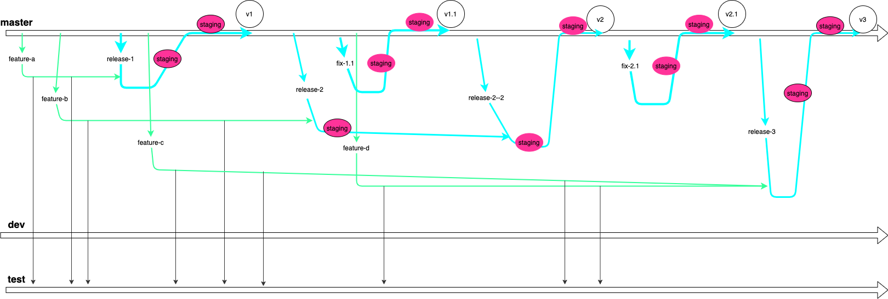

# 基于 release 版本号的 GIt Flow

## 目的

- 上线的代码都得到尽可能验证，尽量减少线上bug。
- 尽量减少因为合并而产生的代码丢失和混乱。

## 环境

- `dev`： 开发联调环境，能发布到这个环境的分支是`dev`。
- `test`： 测试环境，能发布到这个环境的分支是`test`。
- `staging`： 预发布环境，上线前验证，能发布到这个环境的分支是`master`、`relese-<version>[-count]`、`hotfix-<version>`，这个环境应尽可能保持和生产环境一致。
- `prod`：生产环境。

## 分支规范

**`master`(or `main`)**

- 主干分支。
- 这个分支必须保持稳定，对应线上运行环境。
- 合并到这个分支的时候一定不能产生冲突（冲突都应该在合并前解决）。

**`dev`**

- 开发联调分支，主要用来联调。
- *注意：因为 dev 分支比较乱，只能把其他分支合并到 dev，不能把 dev 合并到其他分支*。
- `dev`时间长了，会越来越偏离`master`，所以应该定期`reset`，恢复成和`master`一致。

**`test`**

- 测试分支，主要用来给测试人员进行测试。
- 合并到这个分支的代码应该保持基本稳定。
- *注意：因为 test 分支比较乱，只能把其他分支合并到 test，不能把 test 合并到其他分支*。
- `test`时间长了会越来越偏离`master`，所以应该定期`reset`，恢复成和`master`一致。

**`release-<version>[-count]`**

- `version`: 发布的版本号。
- `count`: 针对同一个版本，开出的发布分支次数(后面讲述作用)。
- 用来发布上线的分支。
- 每一个新版本发布时，都应从`master`拉出发布分支`release-<version>`，将要发布的代码合并上去，在 `staging环境`测试，完毕后合并回`master`。
- 为了保证合并到 `master` 时不产生冲突，`release-<version>` 分支拉出到合并回`master`期间，`master`上`尽可能`不合并其他代码。
- 如果 `release-<version>` 分支拉出后因为某种原因不能及时上线，在这期间 `master` 上合并了其他 `fix` 的代码，则应该从新拉一个 `release-<version>-2` 分支，将原来的 `release-<version>` 分支合并上去，用新的`release-<version>-2`继续上线。

**`fix-<version>`**

- 紧急`bug`修复分支。
- `fix-<version>`不能存在太久。
- 为避免合并冲突，`fix-<version>`拉出到合并回`master`期间，`master`上`一定不能`合并其他代码。

**`feature-<feature>`**

- 新功能开发分支。
- 相同的功能一个分支。

## 开发流程：新功能

1. 从 `master` 最新代码拉出分支`feature-<feature>`。
2. 将 `feature-<feature>` 合并到 `dev` 在 `dev环境` 预览、联调。
3. 将 `feature-<feature>` 合并到 `test`， 在 `test环境` 测试。
4. 从 `master` 拉出发布分支 `release-<version>`，将`feature-<feature>`合并到`release-<version>`。
5. 将 `release-<version>` 发布到 `staging环境` 验证测试。
6. 将 `release-<version>` 合并到 `master`。
7. 将 `master` 发布到 `staging环境` 验证测试。
8. 将 `master` 发布到生产环境，打`tag`。

如果第`5`步 `release-<version>` 发布到`staging环境`后，`master`分支上合并了其他代码（`fix`代码），则应该新拉一个发布分支`release-<version>-2`：

6. 从 `master` 拉出新的发布分支`release-<version>-2`，将`release-<version>`合并到`release-<version>-2`，将`release-<version>-2`发布到 `staging环境`验证测试。
7. 将 `release-<version>-2` 合并到 `master`。
8. 将 `master` 发布到 `staging环境` 验证测试。
9. 将 `master` 发布到生产环境，打`tag`。

## 开发流程：紧急`bug`修复。

- 1. 从 `master` 最新代码拉出分支`fix-<version>`。
- 2. 将 `fix-<version>` 发布到 `staging环境` 验证测试。
- 3. 将 `fix-<version>` 合并到 `master`。
- 4. 将 `master` 发布到 `staging环境` 验证测试。
- 5. 将 `master` 发布到生产环境，打`tag`。

